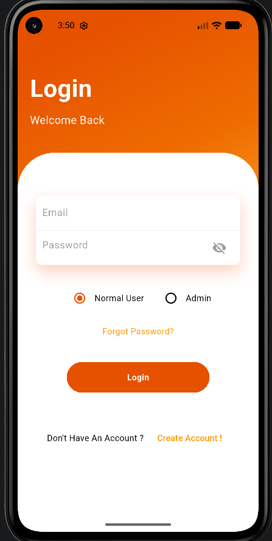
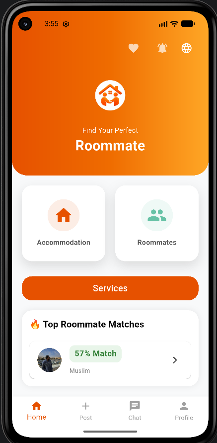

# Roommate Matching and Residential Accommodations App

An end-to-end, full-stack cross-platform mobile application designed to streamline community roommate matching and residential accommodations management. Built using Flutter for a seamless cross-platform experience and powered by Firebase for robust backend cloud-native services.

---

## Features

- **User Authentication:** Secure sign-up/login processes handled via Firebase Authentication.
- **Smart Matching Algorithm:** Matches users with potential roommates based on shared preferences and lifestyle choices.
- **Real-Time Database and Chat:** Dynamic property listings, filtering, and instant real-time messaging using Firebase Firestore.
- **Automated Backend Logic:** Leverages Firebase Cloud Functions for server-side logic and managing push notifications.

---

## Tech Stack

- **Frontend:** Flutter (Dart), flutter_animate (for dynamic UI rendering and animations).
- **Backend and Cloud:** Firebase (Auth, Firestore, Cloud Functions, Crashlytics, Hosting).
- **Database:** Firebase Firestore (NoSQL relational schema structure).
- **Version Control:** Git and GitHub.

---

## Architecture and Clean Code

The project is structured following clean architecture principles to ensure scalability, maintainability, and loose coupling:
- **Data Layer:** Handles API calls, Firebase Firestore data streams, and local data persistence.
- **Domain Layer:** Contains core business logic, entities, and use cases (independent of frameworks).
- **Presentation Layer:** Manages UI states, widgets, and smooth user experiences utilizing reactive state management.

---

## Screenshots and Demo

| Splash and Authentication | Roommate Matching UI | Chat and Property Listings |
| --- | --- | --- |
|  |  |  |


---

## Setup and Installation

1. **Clone the repository:**
```bash
   git clone [https://github.com/MoaazAlkehelat/](https://github.com/MoaazAlkehelat/)[Your-Repository-Name].git